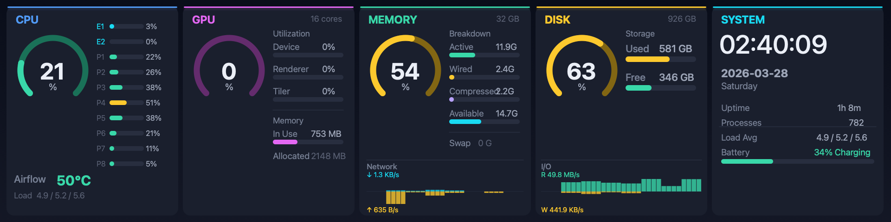

# MacTR

[English](README.md)

**Mac + Thermalright** — Thermalright Trofeo Vision 9.16 LCD 디스플레이를 위한 네이티브 macOS 메뉴바 앱.

Thermalright CPU 쿨러의 1920x480 LCD를 macOS에서 실시간 시스템 모니터링 대시보드로 활용합니다. Windows 없이 사용 가능.



## 주요 기능

- **5패널 대시보드**: CPU, GPU, Memory, Disk, System
- **CPU 온도** — IOHIDEventSystemClient 사용 (sudo 불필요)
- **180° 회전 토글** — 화면이 뒤집혀 보이는 디스플레이를 위한 설정 옵션
- **네트워크 트래픽** — 다운로드/업로드 미러 바 차트
- **디스크 I/O** — 읽기/쓰기 미러 바 차트
- **USB 핫플러그** — 연결/해제 자동 감지, 잠자기 복구
- **메뉴바 앱** — 백그라운드 실행, Dock 아이콘 없음
- **연결 상태 배지** — LCD 미연결 시 빨간색 표시
- **소프트웨어 밝기** — 10단계 조절
- **적응형 레이아웃** — 8~24+ 코어 지원 (M1~M5)
- **자동 업데이트** — Sparkle 기반 1일 1회 자동 체크, 수동 ⌘U

## 하드웨어

|  |  |
|---|---|
| **제품** | <a href="https://www.thermalright.com/product/trofeo-vision-9-16-lcd-black/" target="_blank">Thermalright Trofeo Vision 9.16 LCD</a> (<a href="https://www.thermalright.com/product/trofeo-vision-9-16-lcd-white/" target="_blank">White</a>) |
| **디스플레이** | 9.16" IPS, 1920 x 480 |
| **연결** | USB Type-C (USB 2.0) |
| **Windows 소프트웨어** | [TRCC (공식)](https://www.thermalright.com/support/download/) |

## 요구 사항

- macOS 26 (Tahoe) — 개발 및 테스트 완료
- macOS 15 (Sequoia) — 호환 가능성 높음 (미테스트)
- macOS 14 (Sonoma) — 소수 수정으로 가능할 수 있음 (미테스트)
- Apple Silicon (M1/M2/M3/M4/M5)
- [Homebrew](https://brew.sh)
- Thermalright LCD 쿨러 (Trofeo Vision 9.16 또는 호환 제품)
- USB-C 직접 연결

## 설치

### 다운로드 (권장)

1. [Releases](https://github.com/beret21/MacTR/releases)에서 `MacTR-x.y.z.zip` 다운로드
2. 압축 해제 후 `MacTR.app`을 Applications로 이동
3. 최초 설치 이후 업데이트는 Sparkle을 통해 자동 배포

### 소스에서 빌드

```bash
brew install libusb pkg-config

git clone https://github.com/beret21/MacTR.git
cd MacTR
swift build -c release

.build/release/MacTR
```

## 사용법

### GUI 모드 (기본)

```bash
./MacTR
```

메뉴바 앱으로 실행됩니다. 디스플레이 아이콘을 클릭하면 연결 상태 확인, 설정, 종료가 가능합니다.

### CLI 모드

```bash
./MacTR --cli                    # LCD에 시스템 모니터 표시
./MacTR --cli --rotate           # 180° 회전 활성화
./MacTR --cli --test             # USB 연결 테스트
./MacTR --cli -b 7              # 밝기 7단계
```

### 스냅샷 모드 (개발용)

```bash
./MacTR --snapshot output.png            # 한 프레임을 PNG로 저장
./MacTR --snapshot output.png --cores 24 # 24코어 레이아웃 시뮬레이션
```

## 대시보드 패널

| 패널 | 표시 항목 |
|------|----------|
| **CPU** | 사용률 아크 게이지, 코어별 바 차트, CPU 온도, Load average (1/5/15분) |
| **GPU** | Device/Renderer/Tiler 활용률, VRAM 사용량 |
| **Memory** | Active/Wired/Compressed/Available 분류, Swap, 네트워크 트래픽 차트 |
| **Disk** | APFS 컨테이너 사용량, 읽기/쓰기 I/O 차트 |
| **System** | 시계, 날짜, 가동 시간, 프로세스 수, Load average, 배터리 |

## 지원 디바이스

| 디바이스 | VID:PID | 프로토콜 | 상태 |
|---------|---------|---------|------|
| Trofeo Vision 9.16 | `0416:5408` | LY Bulk | 테스트 완료 |
| LY1 변형 | `0416:5409` | LY1 Bulk | 지원 (미테스트) |

## 프로토콜

USB 통신은 [thermalright-trcc-linux](https://github.com/Lexonight1/thermalright-trcc-linux) 프로젝트에서 리버스 엔지니어링된 LY Bulk 프로토콜을 기반으로 합니다.

1. **핸드셰이크**: 2048바이트 초기화 → 512바이트 응답 → PM/SUB/FBL 추출
2. **프레임 전송**: JPEG 1920x480, 180° 회전, 512바이트 청크로 분할
3. **화면 유지**: 0.5초 간격으로 프레임 반복 전송 (중단 시 수 초 내 화면 꺼짐)

## 감사의 글

- [thermalright-trcc-linux](https://github.com/Lexonight1/thermalright-trcc-linux) — LY Bulk 프로토콜 리버스 엔지니어링
- [fermion-star/apple_sensors](https://github.com/fermion-star/apple_sensors) — IOHIDEventSystemClient 온도 읽기

## 변경 이력

### v1.3.5 (2026-04-09)
- 잠자기/깨우기 후 메트릭 정지 수정 — CPU, GPU, Memory, Disk가 정지되고 시계만 갱신되던 문제
- 모든 재연결 경로(깨우기, 핫플러그, 오류 복구, 수동 재연결)에서 메트릭 수집 재시작 보장
- diskutil 서브프로세스에 5초 타임아웃 추가 (메트릭 큐 정지 방지)
- CLI 모드에서 메트릭 수집 미시작 수정 (프레임이 렌더링되지 않던 문제)
- 메트릭 라이프사이클 진단 로그 추가 (시작/중지/루프 이벤트)

### v1.3.4 (2026-04-05)
- 폰트 캐시 버그 수정 — 패널 간 잘못된 폰트 weight로 텍스트 렌더링되던 문제 해결
- 스냅샷 모드 수정 (`--snapshot`에서 `--cores` 없이 사용 시 파일 미생성 문제)
- LCD 연결 해제 시 메트릭 수집 중지 (CPU/리소스 절약)

### v1.3.3 (2026-04-02)
- 앱 번들 권한 수정 (700 → 755)으로 Sparkle 자동 업데이트 안정화

### v1.3.2 (2026-04-02)
- 업데이트 다이얼로그에 깔끔한 인라인 릴리즈 노트 표시 (GitHub 페이지 임베드 제거)

### v1.3.1 (2026-04-02)
- 메뉴바 드롭다운 상단에 버전 번호(MacTR vX.Y.Z) 표시
- "Check for Updates..." 메뉴 항목 분리 및 ⌘U 단축키 추가

### v1.3.0 (2026-04-02)
- 백그라운드 메트릭 수집 — 프레임 리프레쉬가 시스템 데이터 수집에 의해 블로킹되지 않음
- 데드라인 기반 프레임 타이밍으로 0.5초 리프레쉬 주기 준수
- Sparkle 기반 자동 업데이트 (1일 1회 자동 체크 + 수동 ⌘U)
- 디스크 메트릭 캐싱으로 서브프로세스 호출 감소

### v1.2.0 (2026-03-29)
- 설정 > Display에 180° 회전 토글 추가 (화면이 뒤집혀 보이는 하드웨어 대응)
- 온도 라벨 "Airflow" → "Temp" 변경 (팬 없는 맥북에어 등 고려)
- CLI: `--rotate` 플래그로 180° 회전 활성화

### v1.1.1 (2026-03-28)
- 수정: 디스크 언마운트(DMG 추출 등) 시 Disk I/O 산술 오버플로우 크래시

### v1.1.0 (2026-03-28)
- P-core / E-core 구분 표시
- `sysctl hw.perflevel0.logicalcpu`로 코어 종류 감지
- 요일 영어 표시
- Network / I/O 차트 레이아웃 통일

### v1.0.0 (2026-03-28)
- 5패널 대시보드: CPU, GPU, Memory, Disk, System
- Airflow 온도 (IOHIDEventSystemClient)
- 네트워크 트래픽 미러 바 차트 (sysctl 64bit)
- 디스크 I/O 미러 바 차트 (IOBlockStorageDriver)
- USB 핫플러그 + 잠자기/깨우기 복구
- 메뉴바 앱 (NSStatusItem, 연결 상태 배지)
- 소프트웨어 밝기 10단계
- 적응형 레이아웃 8~24+ 코어
- About 메뉴 (버전 표시)
- .app 번들 패키징 (libusb 내장)

## 후원

이 프로젝트가 도움이 되셨다면 커피 한 잔 사주세요 :)

[](https://ko-fi.com/beret21)

## 문의

질문, 버그 리포트, 기능 요청은 [Issue](https://github.com/beret21/MacTR/issues)를 열어주세요.

## 라이선스

MIT

---

Swift 6.3 + libusb로 개발. [Claude](https://claude.ai)와 공동 개발.
